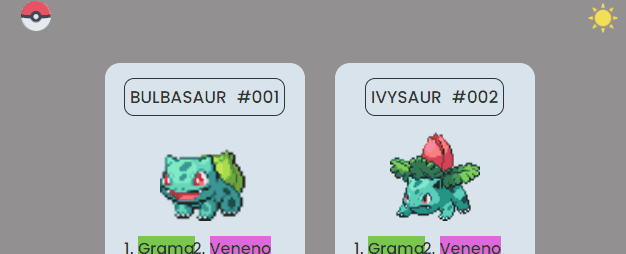
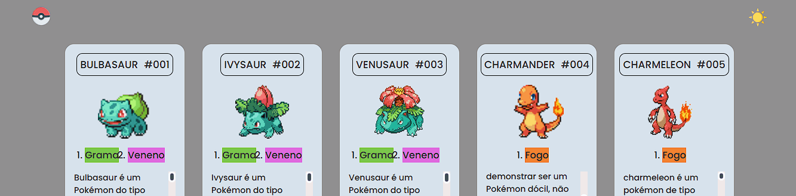

# LISTAGEM POKÉMON 😛
Um projeto com os meus personagens favoritos no Pokémon.🚀

## TECNOLOGIAS USADAS
- HTML
- CSS
- JAVASCRIPT

### BIOGRAFIA 👨‍🏫
Esse projeto foi feito para relembrar a base de HTML, CSS e JavaScript. Com ele, aprendi ainda mais a utilizar as ferramentas para a criação de páginas. Mesmo sabendo outras linguagens, acabamos esquecendo um pouco da base de tudo. Por esse motivo, voltei um pouco no tempo para refrescar a memória com o mundo dos personagens da minha infância, os Pokémons. Click na imagem para ser redirecionado para a pagina do projeto.

